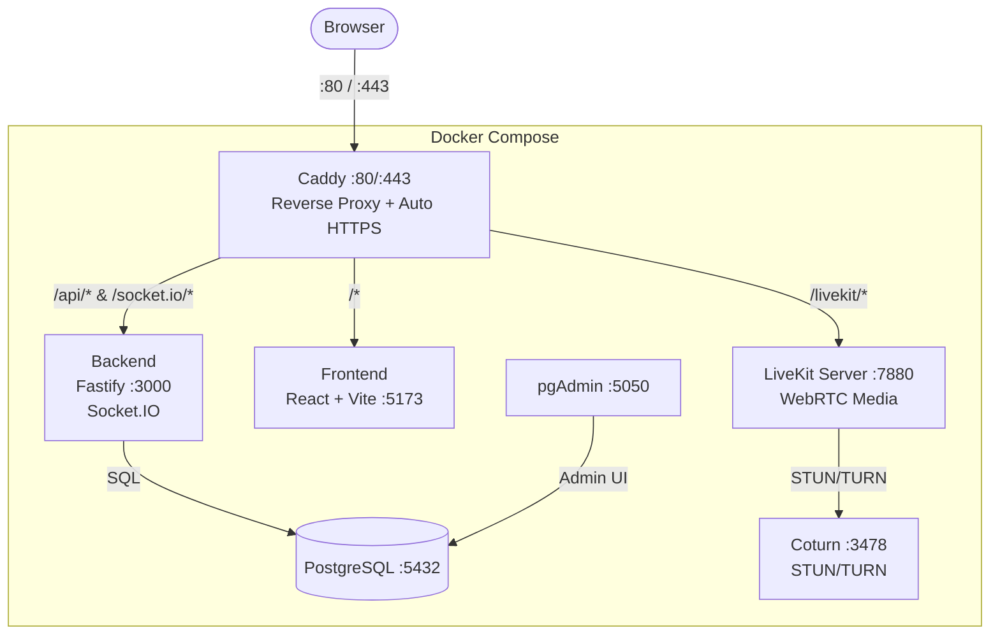

# Divergence

A proof of concept for building my own Discord from scratch. This open-source, self-hostable chat application features real-time text messaging, voice channels, and screen sharing -- all built with modern web technologies.

## Demo

<video src="Assets/demo.mp4" controls width="100%"></video>

> *Self-hosted with port forwarding -- text channels, voice chat & screen sharing in action.*

## Features

- **Authentication** -- Register & login with JWT-based sessions
- **Text Channels** -- Create channels and exchange messages in real time via WebSocket
- **Voice Channels** -- Join voice rooms powered by LiveKit (WebRTC)
- **Screen Sharing** -- Share your screen in voice channels
- **Real-time Presence** -- See who's connected in each voice channel
- **Channel Types** -- Text-only, voice-only, or mixed channels

## Tech Stack

### Backend

| Technology | Role |
|---|---|
| [Fastify](https://fastify.dev/) | HTTP API framework |
| [Socket.IO](https://socket.io/) | Real-time WebSocket layer |
| [PostgreSQL 16](https://www.postgresql.org/) | Database |
| [LiveKit Server SDK](https://livekit.io/) | Voice token generation |
| [Zod](https://zod.dev/) | Request validation |
| [JWT](https://github.com/auth0/node-jsonwebtoken) + [bcrypt](https://github.com/kelektiv/node.bcrypt.js) | Authentication |
| TypeScript + [tsx](https://tsx.is/) | Language & dev runner |

### Frontend

| Technology | Role |
|---|---|
| [React 18](https://react.dev/) | UI framework |
| [Vite](https://vitejs.dev/) | Build tool & dev server |
| [Socket.IO Client](https://socket.io/) | Real-time messaging |
| [LiveKit Client](https://docs.livekit.io/client-sdk-js/) | Voice & screen sharing |

### Infrastructure

| Technology | Role |
|---|---|
| [Docker](https://www.docker.com/) + [Docker Compose](https://docs.docker.com/compose/) | Container orchestration |
| [Caddy 2](https://caddyserver.com/) | Reverse proxy with automatic HTTPS |
| [LiveKit Server](https://livekit.io/) | WebRTC media server |
| [Coturn](https://github.com/coturn/coturn) | STUN/TURN server for NAT traversal |
| [pgAdmin 4](https://www.pgadmin.org/) | Database admin UI |

## Architecture



## Prerequisites

- [Docker](https://docs.docker.com/get-docker/) & [Docker Compose](https://docs.docker.com/compose/install/)
- A server with a public IP address (for voice/TURN to work)

## Getting Started

### 1. Clone the repository

```bash
git clone https://github.com/<your-username>/Divergence.git
cd Divergence
```

### 2. Configure environment files

#### Backend

Copy the example and edit it:

```bash
cp back/.ENV.Example back/.ENV
```

```env
DATABASE_URL=postgres://dbuser:dbpass@db:5432/app
JWT_SECRET=change-me-to-a-strong-random-string
```

> **Important:** Replace `JWT_SECRET` with a strong random value in production.

#### Frontend

```bash
cp front/.env.example front/.env.local
```

```env
VITE_API_URL=https://chat.<YOUR_IP>.nip.io/api
VITE_LIVEKIT_URL=wss://chat.<YOUR_IP>.nip.io/livekit
VITE_SOCKET_URL=https://chat.<YOUR_IP>.nip.io
```

Replace `<YOUR_IP>` with your server's public IP address (dots are fine -- nip.io resolves them automatically).

### 3. Configure LiveKit

```bash
cp Example.livekit.yaml livekit.yaml
```

Edit `livekit.yaml` and replace `IP_ADDRESS` with your server's public IP:

```yaml
port: 7880
rtc:
  udp_port: 7881
  tcp_port: 7882
  use_external_ip: true
  stun_servers:
    - stun.l.google.com:19302
  turn_servers:
    - host: <YOUR_IP>
      port: 3478
      protocol: udp
      username: turnuser
      credential: turnpass
    - host: <YOUR_IP>
      port: 3478
      protocol: tcp
      username: turnuser
      credential: turnpass
keys:
  devkey: devsecret
```

> **Production:** Replace `devkey: devsecret` with a strong API key/secret pair and update the backend accordingly.

### 4. Configure Caddy

```bash
cp caddy/Example_Caddyfile caddy/Caddyfile
```

Edit `caddy/Caddyfile` and replace `<IP_ADRESS>` with your server's public IP:

```
chat.<YOUR_IP>.nip.io {
  encode gzip zstd

  handle_path /api/* {
    reverse_proxy back:3000
  }

  handle /socket.io/* {
    reverse_proxy back:3000
  }

  handle_path /livekit/* {
    reverse_proxy livekit:7880
  }

  handle {
    reverse_proxy front:5173
  }
}
```

### 5. Configure Docker Compose

```bash
cp Example_docker-compose.yml docker-compose.yml
```

Edit `docker-compose.yml` and replace `<IP_ADDRESS>` with your server's public IP in the Coturn configuration.

### 6. Launch

```bash
docker compose up -d
```

The application will be available at `https://chat.<YOUR_IP>.nip.io`.

## API Reference

All authenticated endpoints require the header: `Authorization: Bearer <token>`

| Method | Endpoint | Auth | Description |
|---|---|---|---|
| `POST` | `/auth/register` | No | Create a new account |
| `POST` | `/auth/login` | No | Login and receive a JWT |
| `GET` | `/channels` | Yes | List all channels |
| `POST` | `/channels` | Yes | Create a new channel |
| `GET` | `/channels/:id/messages` | Yes | Get messages for a channel |
| `POST` | `/channels/:id/messages` | Yes | Send a message to a channel |
| `POST` | `/voice/token` | Yes | Get a LiveKit access token |

### WebSocket Events (Socket.IO)

**Client -> Server:**
- `join` -- Join a channel room
- `leave` -- Leave a channel room
- `voice:join` -- Signal voice channel join
- `voice:leave` -- Signal voice channel leave

**Server -> Client:**
- `new_message` -- New message in the current channel
- `voice:state` -- Updated voice presence for a channel

## Database Schema

The backend auto-creates these tables on startup:

```sql
users (
  id          UUID PRIMARY KEY,
  username    TEXT UNIQUE NOT NULL,
  password_hash TEXT NOT NULL
)

channels (
  id          UUID PRIMARY KEY,
  name        TEXT NOT NULL,
  type        TEXT NOT NULL,          -- 'text' | 'voice' | 'both'
  created_at  TIMESTAMPTZ DEFAULT now()
)

messages (
  id          UUID PRIMARY KEY,
  channel_id  UUID REFERENCES channels(id),
  author_id   UUID REFERENCES users(id),
  content     TEXT NOT NULL,          -- max 2000 characters
  created_at  TIMESTAMPTZ DEFAULT now()
)
```

## Project Structure

```
Divergence/
├── back/                       # Backend API
│   ├── src/
│   │   ├── index.ts            # Server entry point & Socket.IO setup
│   │   ├── auth.ts             # JWT utilities
│   │   ├── db.ts               # PostgreSQL connection & schema init
│   │   └── routes/
│   │       ├── auth.ts         # Register & login endpoints
│   │       ├── channels.ts     # Channel CRUD
│   │       ├── messages.ts     # Message endpoints
│   │       └── voice.ts        # LiveKit token generation
│   ├── Dockerfile
│   └── package.json
├── front/                      # Frontend SPA
│   ├── src/
│   │   ├── App.tsx             # Main application component
│   │   ├── socket.ts           # Socket.IO client instance
│   │   └── components/
│   │       └── VoiceButton.tsx  # Voice channel UI
│   ├── Dockerfile
│   ├── vite.config.ts
│   └── package.json
├── caddy/
│   └── Example_Caddyfile       # Reverse proxy template
├── Example_docker-compose.yml  # Docker Compose template
├── Example.livekit.yaml        # LiveKit config template
└── README.md
```

## Development

To run the project locally without Docker:

### Backend

```bash
cd back
cp .ENV.Example .ENV
# Edit .ENV with your local PostgreSQL credentials
npm install
npm run dev
```

### Frontend

```bash
cd front
cp .env.example .env.local
# Edit .env.local to point to your local backend
npm install
npm run dev
```

## Contributing

Contributions are welcome! Feel free to open issues and pull requests.

1. Fork the repository
2. Create your feature branch (`git checkout -b feature/my-feature`)
3. Commit your changes (`git commit -m 'Add my feature'`)
4. Push to the branch (`git push origin feature/my-feature`)
5. Open a Pull Request

## License

This project is open source and available under the [MIT License](LICENSE).
